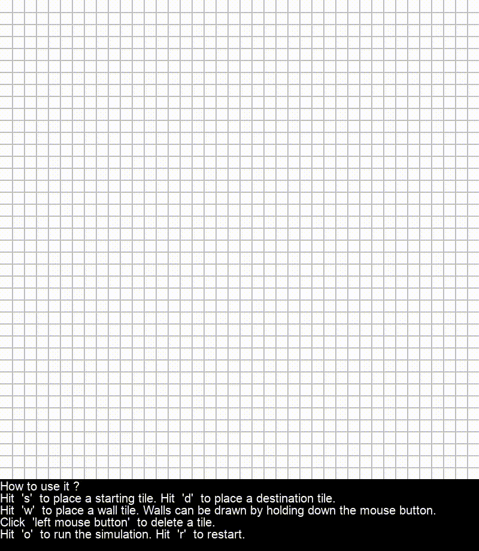

# Pygame Implementations

---
### A pygame implementation to visualize path search algorithms. 

The code is a prototype. It is not refactored for best practices.

  - [x] BFS Search implemented.
    
**How to use it ?** 

**To run the implementation:**  
Command -> `git clone https://github.com/github_name/repository_name`\
Command -> `pip install -r /path_to/requirements.txt`\
Command -> `python play_game.py`  

[*Requirements:*](requirements.txt)    
pygame==2.1.2

---

#### After selecting the game screen:

**Keyboard commands:**\
Hit **'s'** : to place a starting tile\
Hit **'d'** : to place a destination tile\
Hit **'w'** : to place a wall tile\
Hit **'o'** : to start the path search simulation\
Hit **'r'** : to reset the simulation and to clean the grid

**Mouse commands:**\
Mouse click 'Right' : to place a tile\
Mouse click 'Left' : to clean a tile

*Walls can be drawn or deleted by holding down the mouse button.*

---
&nbsp;
**A demonstration:**

---
